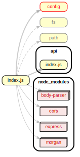

<!-- BEGIN title -->

# Deployment Entry Point

<!-- END title -->

<!-- BEGIN TREE -->

<!-- END TREE -->

<!-- BEGIN TOC -->

- .vscode
- api
- client
- data
- planning
- [index.js](#indexjs)
- [vite.config.js](#viteconfigjs)

---

<!-- END TOC -->

---

<!-- BEGIN DOCS -->

# /.vscode

---

# /api

---

# /client

---

# /data

---

# /planning

---

<a href="../../index.js" id="indexjs">../index.js</a>

<a href="../../vite.config.js" id="viteconfigjs">../vite.config.js</a>

<!-- END DOCS -->
