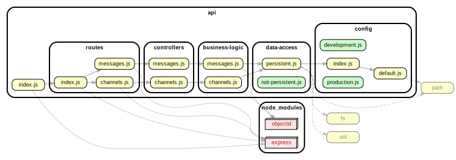

<!-- BEGIN title -->

# API

<!-- END title -->

<!-- BEGIN TREE -->

<!-- END TREE -->

<!-- BEGIN TOC -->

- business-logic
  - [channels.js](#apibusiness-logicchannelsjs)
  - [messages.js](#apibusiness-logicmessagesjs)
- config
  - [default.js](#apiconfigdefaultjs)
  - [development.js](#apiconfigdevelopmentjs)
  - [index.js](#apiconfigindexjs)
  - [production.js](#apiconfigproductionjs)
- controllers
  - [channels.js](#apicontrollerschannelsjs)
  - [messages.js](#apicontrollersmessagesjs)
- data-access
  - [not-persistent.js](#apidata-accessnot-persistentjs)
  - [persistent.js](#apidata-accesspersistentjs)
- routes
  - [channels.js](#apirouteschannelsjs)
  - [index.js](#apiroutesindexjs)
  - [messages.js](#apiroutesmessagesjs)
- utils
- [index.js](#apiindexjs)

---

<!-- END TOC -->

---

<!-- BEGIN DOCS -->

# /business-logic

<a href="../../api/business-logic/channels.js" id="apibusiness-logicchannelsjs">../api/business-logic/channels.js</a>

<a href="../../api/business-logic/messages.js" id="apibusiness-logicmessagesjs">../api/business-logic/messages.js</a>

---

# /config

<a href="../../api/config/default.js" id="apiconfigdefaultjs">../api/config/default.js</a>

<a href="../../api/config/development.js" id="apiconfigdevelopmentjs">../api/config/development.js</a>

<a href="../../api/config/index.js" id="apiconfigindexjs">../api/config/index.js</a>

<a href="../../api/config/production.js" id="apiconfigproductionjs">../api/config/production.js</a>

---

# /controllers

<a href="../../api/controllers/channels.js" id="apicontrollerschannelsjs">../api/controllers/channels.js</a>

<a href="../../api/controllers/messages.js" id="apicontrollersmessagesjs">../api/controllers/messages.js</a>

---

# /data-access

<a href="../../api/data-access/not-persistent.js" id="apidata-accessnot-persistentjs">../api/data-access/not-persistent.js</a>

<a href="../../api/data-access/persistent.js" id="apidata-accesspersistentjs">../api/data-access/persistent.js</a>

---

# /routes

<a href="../../api/routes/channels.js" id="apirouteschannelsjs">../api/routes/channels.js</a>

<a href="../../api/routes/index.js" id="apiroutesindexjs">../api/routes/index.js</a>

<a href="../../api/routes/messages.js" id="apiroutesmessagesjs">../api/routes/messages.js</a>

---

# /utils

---

<a href="../../api/index.js" id="apiindexjs">../api/index.js</a>

<!-- END DOCS -->
