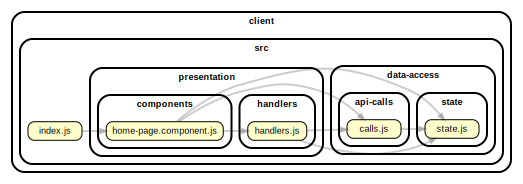

<!-- BEGIN title -->

# CLIENT

<!-- END title -->

<!-- BEGIN TREE -->

<!-- END TREE -->

<!-- BEGIN TOC -->

- assets
- src
  - data-access
    - api-calls
      - [calls.js](#clientsrcdata-accessapi-callscallsjs)
    - state
      - [state.js](#clientsrcdata-accessstatestatejs)
  - presentation
    - components
      - [home-page.component.js](#clientsrcpresentationcomponentshome-pagecomponentjs)
    - handlers
      - [handlers.js](#clientsrcpresentationhandlershandlersjs)
  - [index.js](#clientsrcindexjs)
- styles

---

<!-- END TOC -->

---

<!-- BEGIN DOCS -->

# /assets

---

# /src

## /data-access

### /api-calls

<a href="../../client/src/data-access/api-calls/calls.js" id="clientsrcdata-accessapi-callscallsjs">../client/src/data-access/api-calls/calls.js</a>

---

### /state

<a href="../../client/src/data-access/state/state.js" id="clientsrcdata-accessstatestatejs">../client/src/data-access/state/state.js</a>

---

---

## /presentation

### /components

<a href="../../client/src/presentation/components/home-page.component.js" id="clientsrcpresentationcomponentshome-pagecomponentjs">../client/src/presentation/components/home-page.component.js</a>

---

### /handlers

<a href="../../client/src/presentation/handlers/handlers.js" id="clientsrcpresentationhandlershandlersjs">../client/src/presentation/handlers/handlers.js</a>

---

---

<a href="../../client/src/index.js" id="clientsrcindexjs">../client/src/index.js</a>

---

# /styles

---

<!-- END DOCS -->
